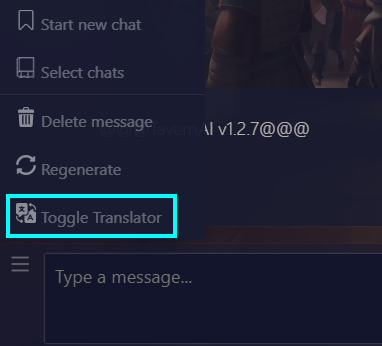

## TavernAI Built-In Translator

[Korean](readme/ko.md)

Adds a translator toggle to TavernAI.

### **It's working with CORS Unblock**

Install [CORS Unblock](https://chrome.google.com/webstore/detail/cors-unblock/lfhmikememgdcahcdlaciloancbhjino/related)
and enable it  
Have suggestion? -> [Here](https://github.com/PleahMaCaka/TavernAI-Translator/issues/2)

## Getting Started

### Prerequisites

- Node.js >= 18.0.0
- npm >= 9.2.0
- pnpm@7.26.3

> npm run init  
> npm run start:tavern

and then

> npm run webpack  
> load extension in chrome (select dist folder)